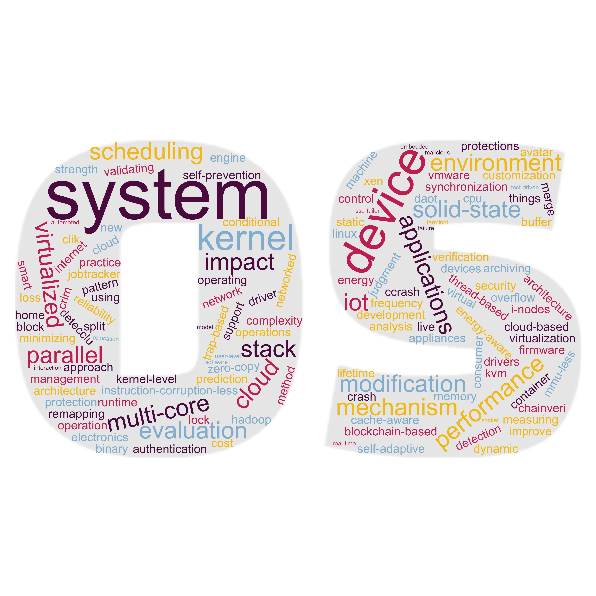

# Overview
## Welcome to INU Operating Systems Laboratory Web pages

- `Operating systems` are essential for feasible system construction and resource management based on computing devices such as cloud, IoT, smartphones, automobiles, and intelligent robots.
- We review, study, tackle various `system research challenges`.
- We do not pursue the right answer only; instead, we try to get `the best solutions` via valid approaches under the given conditions.
- **Join** us if you agree with our approach and vision.

# Research Area

- OS kernel-level support for high-availability, high-performance, and high-reliability.
- Distributed cluster resource management based on system virtualization
- Workload characterization and resource scheduling for cloud XaaS
- Other interesting system-related issues

# Available positions

- Undergraduate research student
- Master's student
- Ph.D student
- Post. Doc. researcher

# Publication

- Selected (2020 - )
  - Hyunchan Park and **Youngpil Kim**, "CLIK: Cloud‐based Linux kernel practice environment and judgment system", in Wiley Computer Applications in Engineering Education,Vol. 28, Issue 5, pp. 1137-1153, Sep 2020.
  - Hyunchan Park ; **Youngpil Kim** ; Seehwan Yoo , "AvaTar: Zero-copy archiving with new kernel-level operations," in IEEE Access, vol. 8, pp. 59315-59325, 2020.   
- [Full List](https://scholar.google.co.kr/citations?user=mLzIIj0AAAAJ&hl=ko)

# Contact

- Prof. Youngpil Kim, Ph.D. (ypkim at inu dot ac dot kr)
